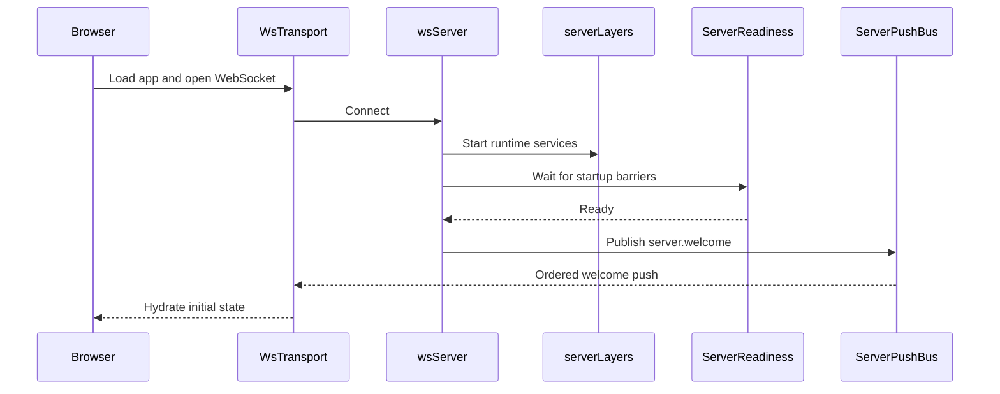
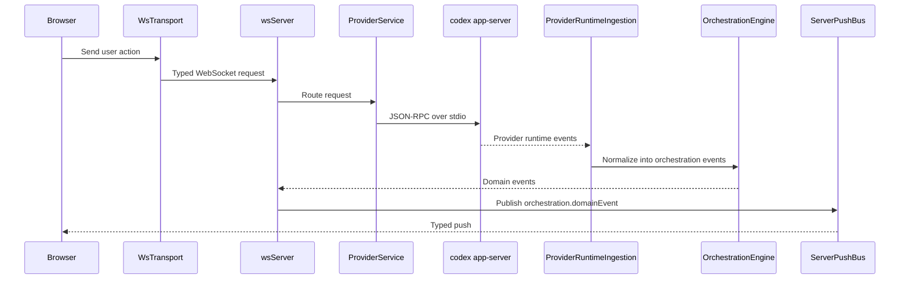
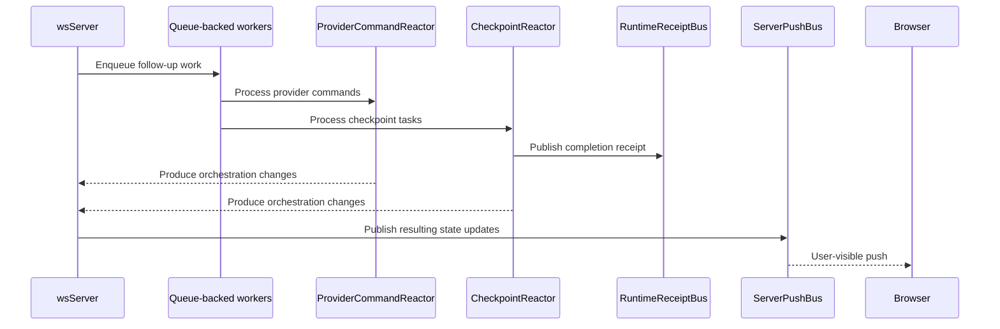

# Architecture

Matcha runs as a **Node.js WebSocket server** that wraps `codex app-server` (JSON-RPC over stdio) and serves a React web app.

```
┌─────────────────────────────────┐
│  Browser (React + Vite)         │
│  wsTransport (state machine)    │
│  Typed push decode at boundary  │
└──────────┬──────────────────────┘
           │ ws://localhost:3773
┌──────────▼──────────────────────┐
│  apps/server (Node.js)          │
│  WebSocket + HTTP static server │
│  ServerPushBus (ordered pushes) │
│  ServerReadiness (startup gate) │
│  OrchestrationEngine            │
│  ProviderService                │
│  CheckpointReactor              │
│  RuntimeReceiptBus              │
└──────────┬──────────────────────┘
           │ JSON-RPC over stdio
┌──────────▼──────────────────────┐
│  codex app-server               │
└─────────────────────────────────┘
```

## Components

- **Browser app**: The React app renders session state, owns the client-side WebSocket transport, and treats typed push events as the boundary between server runtime details and UI state.

- **Server**: `apps/server` is the main coordinator. It serves the web app, accepts WebSocket requests, waits for startup readiness before welcoming clients, and sends all outbound pushes through a single ordered push path.

- **Provider runtime**: `codex app-server` does the actual provider/session work. The server talks to it over JSON-RPC on stdio and translates those runtime events into the app's orchestration model.

- **Background workers**: Long-running async flows such as runtime ingestion, command reaction, and checkpoint processing run as queue-backed workers. This keeps work ordered, reduces timing races, and gives tests a deterministic way to wait for the system to go idle.

- **Runtime signals**: The server emits lightweight typed receipts when important async milestones finish, such as checkpoint capture, diff finalization, or a turn becoming fully quiescent. Tests and orchestration code wait on these signals instead of polling internal state.

## Event Lifecycle

### Startup and client connect



1. The browser boots [`WsTransport`][1] and registers typed listeners in [`wsNativeApi`][2].
2. The server accepts the connection in [`wsServer`][3] and brings up the runtime graph defined in [`serverLayers`][7].
3. [`ServerReadiness`][4] waits until the key startup barriers are complete.
4. Once the server is ready, [`wsServer`][3] sends `server.welcome` from the contracts in [`ws.ts`][6] through [`ServerPushBus`][5].
5. The browser receives that ordered push through [`WsTransport`][1], and [`wsNativeApi`][2] uses it to seed local client state.

### User turn flow



1. A user action in the browser becomes a typed request through [`WsTransport`][1] and the browser API layer in [`nativeApi`][12].
2. [`wsServer`][3] decodes that request using the shared WebSocket contracts in [`ws.ts`][6] and routes it to the right service.
3. [`ProviderService`][8] starts or resumes a session and talks to `codex app-server` over JSON-RPC on stdio.
4. Provider-native events are pulled back into the server by [`ProviderRuntimeIngestion`][9], which converts them into orchestration events.
5. [`OrchestrationEngine`][10] persists those events, updates the read model, and exposes them as domain events.
6. [`wsServer`][3] pushes those updates to the browser through [`ServerPushBus`][5] on channels defined in [`orchestration.ts`][11].

### Async completion flow



1. Some work continues after the initial request returns, especially in [`ProviderRuntimeIngestion`][9], [`ProviderCommandReactor`][13], and [`CheckpointReactor`][14].
2. These flows run as queue-backed workers using [`DrainableWorker`][16], which helps keep side effects ordered and test synchronization deterministic.
3. When a milestone completes, the server emits a typed receipt on [`RuntimeReceiptBus`][15], such as checkpoint completion or turn quiescence.
4. Tests and orchestration code wait on those receipts instead of polling git state, projections, or timers.
5. Any user-visible state changes produced by that async work still go back through [`wsServer`][3] and [`ServerPushBus`][5].

[1]: ../apps/web/src/wsTransport.ts
[2]: ../apps/web/src/wsNativeApi.ts
[3]: ../apps/server/src/wsServer.ts
[4]: ../apps/server/src/wsServer/readiness.ts
[5]: ../apps/server/src/wsServer/pushBus.ts
[6]: ../packages/contracts/src/ws.ts
[7]: ../apps/server/src/serverLayers.ts
[8]: ../apps/server/src/provider/Layers/ProviderService.ts
[9]: ../apps/server/src/orchestration/Layers/ProviderRuntimeIngestion.ts
[10]: ../apps/server/src/orchestration/Layers/OrchestrationEngine.ts
[11]: ../packages/contracts/src/orchestration.ts
[12]: ../apps/web/src/nativeApi.ts
[13]: ../apps/server/src/orchestration/Layers/ProviderCommandReactor.ts
[14]: ../apps/server/src/orchestration/Layers/CheckpointReactor.ts
[15]: ../apps/server/src/orchestration/Layers/RuntimeReceiptBus.ts
[16]: ../packages/shared/src/DrainableWorker.ts
